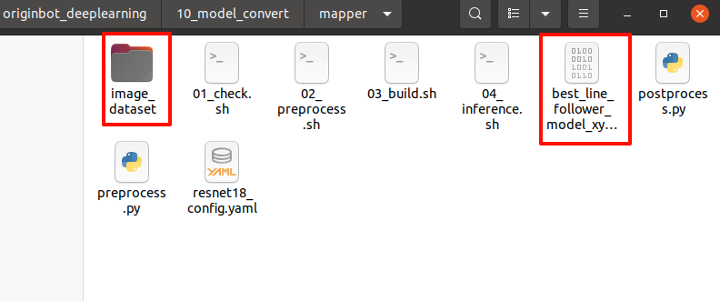
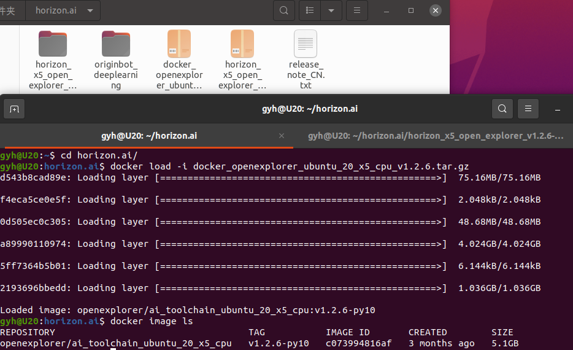
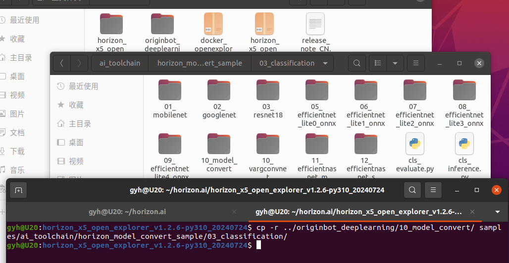
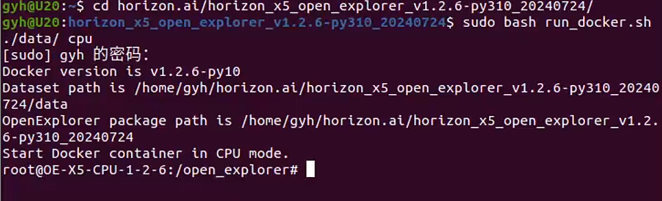
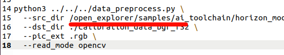

# x5_line_follow

> https://developer.d-robotics.cc/forumDetail/251934919646096384

## ubuntu20.04 ROS 2+Docker

安装ROS、Docker

```bash
wget http://fishros.com/install -O fishros && . fishros
```

## line_follower

```bash
mkdir -p ~/dev_ws/src
cd ~/dev_ws/src
git clone https://gitee.com/yzhcat/line_follower.git -b feature-x5-usb_cam
```

编译功能包

```bash
cd ~/dev_ws
colcon build --symlink-install --packages-select line_follower_model
```

数据标注

```bash
# bot
ros2 launch line_follower_perception usb_cam_web.launch.py
# PC
cd ~/dev_ws
source install/setup.bash
ros2 run line_follower_model annotation
```

训练模型

1. 安装pytorch
```bash
python3 -m venv .pytorch_venv
source .pytorch_venv/bin/activate
pip3 install torch torchvision torchaudio --extra-index-url https://download.pytorch.org/whl/cpu
```

2. 训练模型

生成文件best_line_follower_model_xy.pth

```bash
cd ~/dev_ws
source install/setup.bash
ros2 run line_follower_model training
```

3. 模型转换

生成best_line_follower_model_xy.onnx

```bash
pip3 install onnx
ros2 run line_follower_model generate_onnx
```

打开/10_model_convert文件夹,把图片数据image_dataset和转换后的best_line_follower_model_xy.onnx模型文件放到10_model_convert/mapper文件夹

​​

修改resnet18_config.yaml文件,把bernoulli2改为bayes-e

```bash
  # 适用BPU架构
  # --------------------
  # the applicable BPU architecture
  #march: "bernoulli2"
  march: "bayes-e"
```

## **OE 1.2.6**

> https://developer.d-robotics.cc/forumDetail/251934919646096384

### OE 开发包

horizon_x5_open_explorer_v1.2.6-py310_20240724.tar.gz

```bash
wget -c ftp://x5ftp@vrftp.horizon.ai/OpenExplorer/v1.2.6_release/horizon_x5_open_explorer_v1.2.6-py310_20240724.tar.gz --ftp-password=x5ftp@123$%
```

### Ubuntu20.04 CPU Docker 镜像

```bash
wget -c ftp://x5ftp@vrftp.horizon.ai/OpenExplorer/v1.2.6_release/docker_openexplorer_ubuntu_20_x5_cpu_v1.2.6.tar.gz --ftp-password=x5ftp@123$%
```

将离线镜像加载到本地。

```bash
docker load -i docker_openexplorer_xxx.tar.gz
docker image ls
```

> #REPOSITORY                                   				TAG           IMAGE ID       CREATED        SIZE  
> #openexplorer/ai_toolchain_ubuntu_20_x5_cpu   v1.2.6-py10   c073994816af   3 months ago   5.1GB

​​

解压 OE 开发包 horizon_x5_open_explorer_v1.2.8-py310_20240926.tar.gz

```bash
tar -xzvf horizon_x5_open_explorer_v1.2.6-py310_20240724.tar.gz
cd horizon_x5_open_explorer_v1.2.6-py310_20240724/
```

修改run_docker.sh，开头中找到 version=v1.2.6 替换为 version=v1.2.6-py310

​​

复制originbot_desktop/originbot_deeplearning/10_model_convert文件夹到samples/ai_toolchain/horizon_model_convert_sample/03_classification/

​​

启动 Docker

```bash
sudo bash run_docker.sh ./data/ cpu
```

​​

> 如果提示Unable to find image 'openexplorer/ai_toolchain_ubuntu_20_x5_cpu:v1.2.6' locally  
> 通过 `docker image ls`​ 命令查看ai_toolchain_ubuntu_20_x5_cpu的TAG是否是v1.2.6-py310  
> 在run_docker.sh开头中找到 version=v1.2.6 替换为 version=v1.2.6-py310

进入到10_model_convert

```bash
cd samples/ai_toolchain/horizon_model_convert_sample/03_classification/10_model_convert/mapper
```

### **生成校准数据**

```bash
sh 02_preprocess.sh
```

> 如果提示FileNotFoundError: [Errno 2] No such file or directory: '/open_explorer/ddk/samples/。。。
>
> 修改02_preprocess.sh中的路径为/open_explorer/samples/
>
> ​​

### **模型编译生成定点模型**

```bash
sh 03_build.sh
```

### 板端部署

ssh 登录rdk x5

获取巡线功能包，复制model_out目录下的resnet18_224x224_nv12.bin文件到line_follower_perception功能包下的model文件夹中

```bash
mkdir -p ~/dev_ws/src
cd ~/dev_ws/src
git clone https://gitee.com/yzhcat/line_follower.git -b feature-x5-usb_cam
mkdir line_follower/line_follower_perception/model
cp {model_path} line_follower/line_follower_perception/model
```

> MobaXterm或者vscode登录可以直接打开对应目录把文件拖进去


编译功能包、运行

```bash
cd ~/dev_ws
colcon build --symlink-install --packages-select line_follower_perception
source install/setup.bash
cd ~/dev_ws/src/line_follower/line_follower_perception/
ros2 run line_follower_perception line_follower_perception --ros-args -p model_path:=model/resnet18_224x224_nv12.bin -p model_name:=resnet18_224x224_nv12
```

打开相机

```bash
ros2 launch originbot_bringup camera_internal.launch.py
# or
ros2 launch line_follower_perception usb_cam_web.launch.py
```

启动OriginBot底盘

```bash
ros2 launch originbot_bringup originbot.launch.py
```

替换功能包：可以用配置好的功能包替换掉默认工作空间的功能包

```bash
rm -r /userdata/dev_ws/src/originbot/originbot_deeplearning/line_follower_perception/
cp -r ~/dev_ws/src/line_follower/line_follower_perception/ /userdata/dev_ws/src/originbot/originbot_deeplearning/
# 重新编译
cd /userdata/dev_ws/
colcon build --symlink-install --packages-select line_follower_perception
```

运行

```bash
cd /userdata/dev_ws/src/originbot/originbot_deeplearning/line_follower_perception/
ros2 run line_follower_perception line_follower_perception --ros-args -p model_path:=model/resnet18_224x224_nv12.bin -p model_name:=resnet18_224x224_nv12

```

‍
